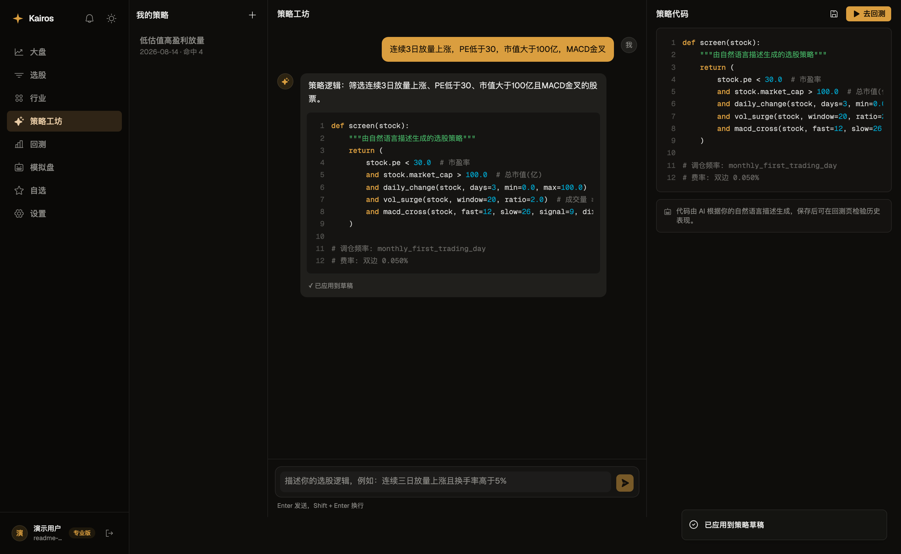
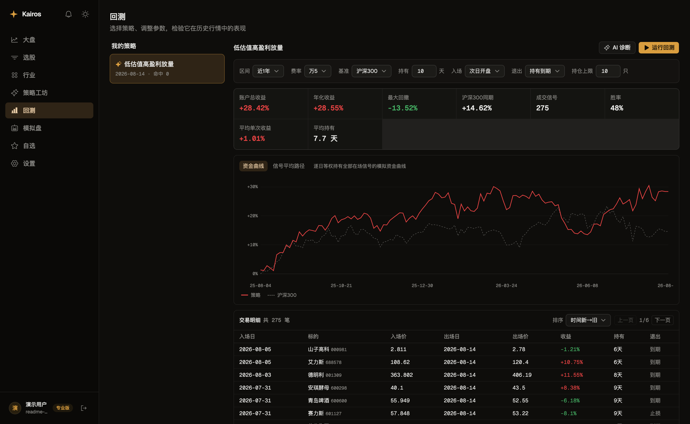
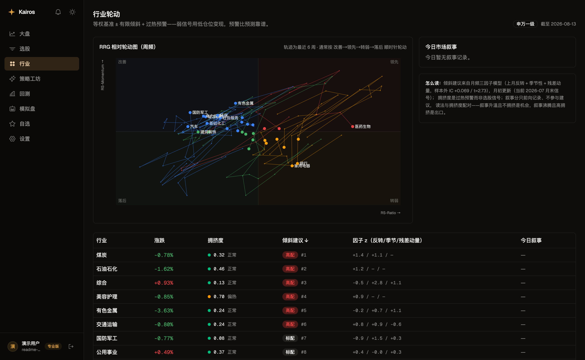
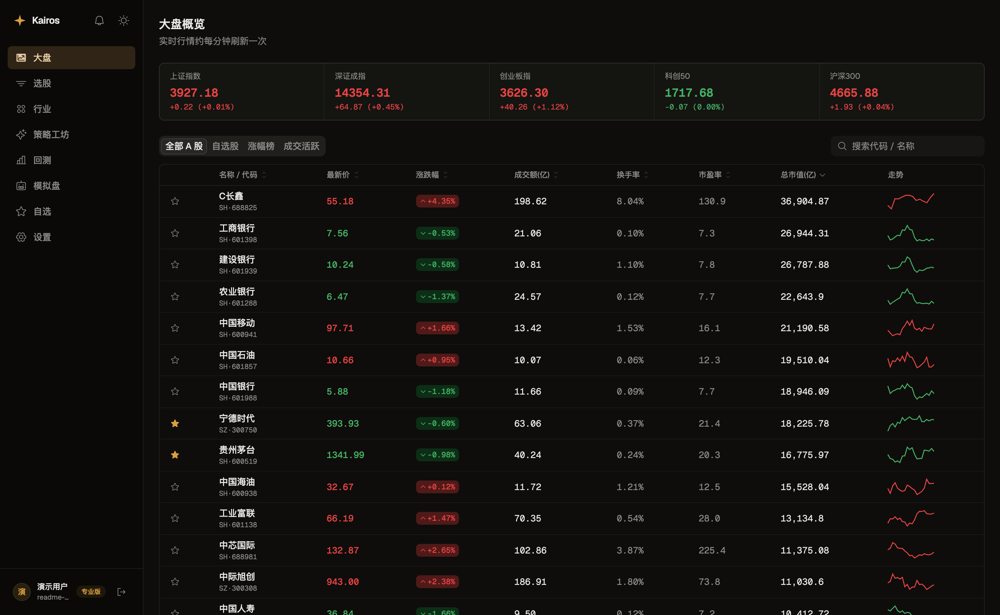
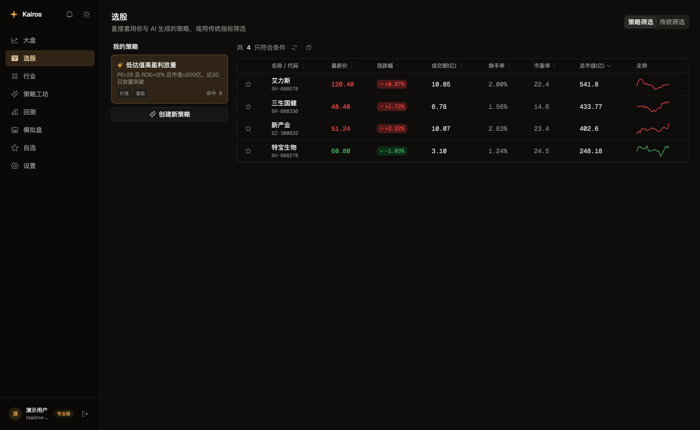

<div align="center">

# Kairos

**A 股智能选股与策略研究平台**

用自然语言描述选股逻辑，AI 生成可回测的策略 DSL，一站式完成 选股 → 回测 → 模拟盘 → 盘后自动运行与推送。

[](./LICENSE)
[](https://www.python.org/)
[](https://fastapi.tiangolo.com/)
[](https://react.dev/)

[在线体验](https://kairos.ren) · [快速开始](#-快速开始) · [架构文档](./docs/ARCHITECTURE.md) · [Roadmap](./docs/ROADMAP.md)



</div>

---

## ✨ 功能特性

- **策略工坊**：自然语言 → AI 流式生成策略 DSL，支持对话式迭代修改；DSL 可校验、可执行、可回测
- **回测引擎**：事件 / 组合两种模式，内置可交易性约束（涨跌停买不进卖不出、费率、仓位容量），输出年化 / 最大回撤 / 夏普 / 胜率 + 净值曲线
- **模拟盘**：已保存策略盘后自动跑信号、逐交易日前瞻结算，与回测**同一套成交语义**，两条曲线直接可比；停机后按交易日历自动补结算
- **盘后自动运行与推送**：交易日收盘后自动运行全部策略，命中变化通过邮件 / Webhook（企业微信、飞书、Server 酱）推送
- **行业轮动**：板块 RRG 相对轮动图、三因子倾斜（残差反转 / 季节性 / 残差动量）、拥挤度过热预警、LLM 叙事因子（只前向记录，永不回测）
- **智能选股**：传统指标筛选（行业 / PE / ROE 等）+ 按已保存策略一键筛选
- **大盘概览**：实时指数 + 行情表（涨幅榜 / 成交活跃 / 自选）
- **账户体系**：邀请制注册、JWT 鉴权、数据按用户隔离，内置邀请码管理后台

### 零依赖也能跑

所有外部依赖都有内置回退，**无需网络、无需任何 API Key 即可完整体验全部功能**：

| 能力 | 生产实现 | 内置回退（默认） |
|---|---|---|
| 行情数据 | AkShare（东财）/ Tencent（腾讯 + 新浪，零额外依赖） | `SeedProvider` 确定性合成数据 |
| AI 生成策略 | DeepSeek API（JSON 输出，国内直连） | 规则解析器（中文关键词 → DSL） |
| 数据库 | MySQL（只改 `DATABASE_URL`） | SQLite |

## 📸 界面预览

| 回测（净值曲线 + 交易明细） | 行业轮动（RRG + 因子倾斜 + 拥挤度） |
|---|---|
|  |  |

| 大盘概览（实时行情） | 选股（按策略一键筛选） |
|---|---|
|  |  |

## 🏗 架构

```
浏览器 ──▶ Nginx :443
             ├── /        → 前端静态文件（React SPA）
             └── /api/    → FastAPI（Docker 容器）
                              ├── SQLite / MySQL
                              ├── 行情采集（每 60s，交易时段）
                              └── APScheduler（盘后策略运行 / 板块日更 / 通知）
```

MVP 刻意采用「单库 + 分钟级采集 + 前端轮询」的低频形态，Redis / MQ / 时序库 / WebSocket 按需后续引入。设计取舍与演进计划见 [`docs/ARCHITECTURE.md`](./docs/ARCHITECTURE.md) 与 [`docs/ROADMAP.md`](./docs/ROADMAP.md)。

## 🧰 技术栈

| 层 | 技术 |
|---|---|
| 前端 | React 19 · Vite · TypeScript · Tailwind CSS v4 · shadcn/base-ui · TanStack Query/Table · react-router |
| 后端 | Python 3.11 · FastAPI · SQLAlchemy 2 · Alembic · APScheduler |
| 数据库 | SQLite（默认）→ MySQL（改一行 `DATABASE_URL` 即迁移） |
| 数据源 | AkShare / 腾讯·新浪行情 / 内置合成数据，可插拔 `DataProvider` |
| AI | DeepSeek API / 内置规则解析器（无 Key 也能用） |
| 部署 | Docker Compose · Nginx · GitHub Actions 自动部署 |

## 🚀 快速开始

### 方式一：Docker Compose

```bash
git clone https://github.com/Lzhtommy/Kairos.git && cd Kairos
docker compose up -d --build     # 后端 :8000（含 AkShare 真实数据支持）
npm install && npm run dev       # 前端 http://localhost:5173
```

### 方式二：本地开发

**后端**（终端 1）：

```bash
cd server
python3 -m venv .venv && . .venv/bin/activate
pip install -r requirements.txt
# 可选：真实行情数据（需可访问东财的网络）
# pip install -r requirements-data.txt
cp .env.example .env
alembic upgrade head
uvicorn app.main:app --reload --port 8000
```

**前端**（终端 2）：

```bash
npm install
npm run dev          # http://localhost:5173（/api 自动代理到 :8000）
```

### 首次使用

注册需要邀请码，先生成一个：

```bash
cd server
python -m scripts.gen_invite_codes           # 生成 1 个邀请码
python -m scripts.set_admin your@email.com   # （注册后）设为管理员，可在后台管理邀请码
```

打开 http://localhost:5173 → 用邀请码注册即可体验全部功能。启动时后端会自动建表并 bootstrap 股票池、基本面与历史 K 线，无需手动初始化。

- API 文档：http://127.0.0.1:8000/docs
- 健康检查：http://127.0.0.1:8000/api/health

## ⚙️ 配置

后端配置全部通过环境变量（`server/.env`，模板见 [`server/.env.example`](./server/.env.example)）：

| 变量 | 默认值 | 说明 |
|---|---|---|
| `DATABASE_URL` | `sqlite:///./data/kairos.db` | 改为 `mysql+pymysql://...` 即迁移 MySQL |
| `JWT_SECRET` | `change-me-in-production` | 生产环境必须修改 |
| `PROVIDER` | `auto` | `auto` / `seed` / `akshare` / `tencent`；auto 依次探测并自动回退 |
| `AI_PROVIDER` | `auto` | `auto` / `rule` / `deepseek`；有 Key 用 DeepSeek，否则规则解析器 |
| `DEEPSEEK_API_KEY` | 空 | 配置后启用 AI 策略生成与叙事因子 |
| `ENABLE_COLLECTOR` | `true` | 是否启动行情采集 |
| `COLLECT_INTERVAL_SECONDS` | `60` | 采集间隔 |
| `CORS_ORIGINS` | `*` | 生产环境建议收紧到本域 |

## 🧪 测试

```bash
cd server
pip install pytest
python -m pytest tests/     # DSL / 回测诚实度 / 模拟盘 / 板块 / 鉴权等 16 组测试
```

## 📦 生产部署

推送到 `main` → GitHub Actions 构建前端 + 同步后端 → 服务器上 Nginx 托管静态文件并把 `/api/` 反代到 Docker 中的 FastAPI。完整步骤（服务器初始化、SSL、密钥配置）见 [`deploy/README.md`](./deploy/README.md)。

## 📚 文档

| 文档 | 内容 |
|---|---|
| [`docs/ARCHITECTURE.md`](./docs/ARCHITECTURE.md) | 系统设计与技术选型 |
| [`docs/EXPR-DSL-DESIGN.md`](./docs/EXPR-DSL-DESIGN.md) | 策略 DSL 设计（截面 / 量能表达式） |
| [`docs/ROADMAP.md`](./docs/ROADMAP.md) | Post-MVP 演进计划（P1–P5） |
| [`server/README.md`](./server/README.md) | 后端细节：降级设计、MySQL 迁移、Docker、目录结构 |
| [`deploy/README.md`](./deploy/README.md) | ECS + Nginx + GitHub Actions 部署 |

## 🤝 贡献

欢迎 Issue 与 PR。提交前请确保：

1. 后端改动跑通 `python -m pytest tests/`
2. 前端改动跑通 `npm run lint && npm run build`
3. 涉及数据库模型的改动附带 Alembic 迁移

## ⚠️ 免责声明

本项目仅供学习与研究使用，**不构成任何投资建议**。策略回测与模拟盘结果基于历史数据，不代表未来收益；股市有风险，投资需谨慎。

## 📄 License

[MIT](./LICENSE)
