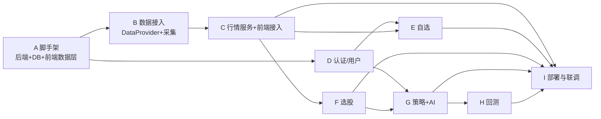

# Kairos MVP 实施任务拆解

> 配套文档：[`ARCHITECTURE.md`](./ARCHITECTURE.md)。本文件把「完整 MVP」拆成可执行、可验收、有依赖关系的任务清单。
> MVP 技术形态（见架构 §2.1）：**SQLite 单库 + 每分钟采集脚本 + FastAPI + 前端 60s 轮询**，先不上 Redis / MQ / 时序库 / WebSocket。

---

## 0. MVP 范围界定

**目标**：现有 5 个页面全部跑在真实后端上，形成「登录 → 看行情 → 选股 → 用 AI 生成策略并回测 → 加自选」的完整闭环。

### ✅ 纳入 MVP
- 账户体系（注册 / 登录 / 当前用户）
- 真实行情（大盘指数 + 个股快照 + 历史 K 线），每分钟更新
- 选股（传统条件筛选 + 按已保存策略筛选）
- 策略工坊（AI 自然语言生成策略 DSL/代码 + 保存 + 简易回测）
- 自选（持久化增删）
- 单 ECS 部署（Nginx 反代 + FastAPI + SQLite）

### ❌ 暂不纳入（Post-MVP）
- WebSocket 实时推送、Redis、消息队列、时序库
- 告警与通知（P6）
- 容器编排 / ACK、可观测性全家桶（P7）
- 商业数据源与行情分发授权（用免费源做演示）
- 策略版本管理 UI、多自选分组、社交/分享

---

## 1. 里程碑与依赖总览

**建议排期**（单人全栈参考，团队并行更快）：

| 里程碑 | Epic | 粗估 |
|---|---|---|
| M1 能跑通 | A + B + C（行情端到端） | ~5–7 天 |
| M2 有账户 | D + E（登录 + 自选） | ~3–4 天 |
| M3 能选股 | F | ~2–3 天 |
| M4 有 AI | G（策略 + AI 生成） | ~4–6 天 |
| M5 能回测 | H | ~4–5 天 |
| M6 上线 | I | ~2–3 天 |

> 估时为编码 + 自测，含前后端。效率标签：**S**≈0.5 天、**M**≈1 天、**L**≈2 天+。

---

## Epic A · 项目脚手架与数据层

> 目标：前后端骨架跑通，一个 `/health` 和一个假 `/quotes` 能被前端读到。

- [ ] **A1 · 后端工程初始化** `M`
  建 `server/` 目录：FastAPI + uvicorn + `pyproject.toml`/`requirements.txt`（fastapi, uvicorn, sqlalchemy, alembic, pydantic-settings, pymysql, akshare）。分包 `app/{api,core,models,schemas,services,providers}`。
  *验收*：`uvicorn app.main:app` 启动，`GET /health` 返回 200。

- [ ] **A2 · 配置与环境变量** `S`
  `pydantic-settings` 读 `DATABASE_URL`、`PROVIDER`、`ANTHROPIC_API_KEY`、`JWT_SECRET` 等；提供 `.env.example`。
  *验收*：`DATABASE_URL=sqlite:///./kairos.db` 默认可用。

- [ ] **A3 · SQLAlchemy + Alembic 接入** `M`
  `Base`、`engine`、`SessionLocal`、依赖注入 `get_db`；SQLite 连接开启 `PRAGMA foreign_keys=ON` 与 WAL；`alembic init`，配置从 `DATABASE_URL` 读。
  *验收*：`alembic revision --autogenerate` 与 `alembic upgrade head` 正常。

- [ ] **A4 · 前端数据层骨架** `M`
  新增 `src/api/client.ts`（fetch 封装 + baseURL + 错误处理）、`src/api/quotes.ts`；引入 **TanStack Query**（`QueryClientProvider` 包在 `main.tsx`）；`.env.development`/`.env.production` 加 `VITE_API_BASE_URL`。
  *验收*：任一页面能通过 `useQuery` 拿到后端 `/health` 或假数据。

- [ ] **A5 · 本地开发 Mock（MSW）** `S`
  用 `mock-data.ts` 作为 MSW handlers 数据源，`VITE_USE_MOCK` 开关切换，保证前端可脱离后端独立开发。
  *验收*：开关打开时前端跑在 mock 上，关闭时打真实后端。

---

## Epic B · 数据接入（DataProvider + 采集）

> 目标：真实 A 股数据每分钟入库。依赖 A3。

- [ ] **B1 · DataProvider 接口定义** `S`
  `providers/base.py`：`get_quotes / get_kline / get_fundamentals / get_indices / trading_calendar`（见架构 §8.2）；定义归一化模型 `Quote/Candle/Fundamental/IndexQuote`。
  *验收*：接口 + 类型可导入，`PROVIDER` 配置能选择实现。

- [ ] **B2 · AkShareProvider 实现** `L`
  用 AkShare 拉实时快照、日线 K 线、基本面、指数；字段映射到归一化模型；加超时、重试、异常兜底。
  *验收*：脚本里 `provider.get_quotes(["600519"])` 返回真实数据。

- [ ] **B3 · 行情数据表与模型** `M`
  按架构 §6.3 建 `quotes / kline / indices / fundamentals` 表（含索引：`quotes(code, ts)`、`kline(code, period, ts)`），Alembic 迁移。
  *验收*：`upgrade head` 后表结构就位。

- [ ] **B4 · 采集脚本 + 定时调度** `M`
  `jobs/collect.py`：按交易日历与交易时段（9:30–11:30 / 13:00–15:00）判断是否采集；每分钟拉快照 upsert 到 `quotes`/`indices`，收盘后拉当日 K 线与基本面。用 APScheduler（进程内）或 crontab。
  *验收*：交易时段内每分钟 `quotes` 表有新快照；非交易时段静默。

- [ ] **B5 · 股票池初始化** `S`
  首次运行拉全 A 股列表（或先用现有 20 支演示池）写入 `quotes` 基础信息（code/name/market/industry）。
  *验收*：股票基础信息落库，可被行情接口引用。

---

## Epic C · 行情服务 + 前端接入

> 目标：大盘页 / 自选页看真实数据。依赖 B、A4。

- [ ] **C1 · 行情读接口** `M`
  `GET /quotes?codes=`（默认返回全池，支持按 code 过滤）、`GET /indices`、`GET /kline?code=&period=&from=&to=`；Pydantic schema 与前端 `Stock`/`IndexQuote` 字段对齐。
  *验收*：接口返回结构与 `mock-data.ts` 类型一致。

- [ ] **C2 · 榜单接口** `S`
  `GET /quotes/ranking?type=gainers|active`（涨幅榜 / 成交活跃），对应 dashboard 的 Tabs；MVP 直接 SQL `ORDER BY` 计算。
  *验收*：涨幅榜 / 活跃榜返回正确排序。

- [ ] **C3 · 前端 `useLiveQuotes` 切真实源** `M`
  改 `src/lib/use-live-quotes.ts`：**保持返回签名 `{ stocks, indices }` 不变**，内部由「2.2s 抖动」改为「TanStack Query 60s 轮询 `/quotes` + `/indices`」。
  *验收*：dashboard / watchlist / screener 页无改动即看到真实数据，每分钟刷新。

- [ ] **C4 · 走势图数据接入** `S`
  `Sparkline` 的 `spark` 由 K 线接口驱动（取近 N 根收盘价）。
  *验收*：行情表走势列展示真实近期走势。

---

## Epic D · 认证与用户

> 目标：可注册登录，侧栏显示真实用户。依赖 A3。

- [ ] **D1 · 用户表与模型** `S`
  `users` 表（见架构 §6.1）；密码用 `passlib[bcrypt]` 哈希。Alembic 迁移。
  *验收*：迁移就位。

- [ ] **D2 · 认证接口** `M`
  `POST /auth/register`、`POST /auth/login`（返回 JWT）、`GET /me`；JWT 签发/校验（`python-jose`），依赖注入 `get_current_user`。
  *验收*：注册→登录→带 token 访问 `/me` 成功；无 token 返回 401。

- [ ] **D3 · 前端登录页与鉴权** `M`
  新增 `pages/login-page.tsx` 与 `src/api/auth.ts`；token 存 `localStorage`，`api/client.ts` 注入 `Authorization`，401 自动跳登录；`/app/*` 路由守卫。
  *验收*：未登录访问 `/app` 跳登录；登录后可进入。

- [ ] **D4 · 侧栏接真实用户** `S`
  `AppShell` 的「陆晓岚 / 专业版」改由 `GET /me` 驱动。
  *验收*：侧栏显示当前登录用户昵称与会员等级。

---

## Epic E · 自选

> 目标：星标持久化。依赖 C、D。

- [ ] **E1 · 自选表与接口** `M`
  `watchlists` / `watchlist_items` 表；`GET /watchlist`、`POST /watchlist/{code}`、`DELETE /watchlist/{code}`（均需登录）。
  *验收*：增删查按用户隔离正确。

- [ ] **E2 · 前端自选联动** `M`
  `quote-table.tsx` 的 `StarToggle` 从本地 `useState` 改为调接口 + TanStack Query 乐观更新；`watchlist-page.tsx` 拉 `/watchlist` 对应个股。
  *验收*：加/移自选刷新后保持；自选页展示真实自选列表；空态正确。

---

## Epic F · 选股

> 目标：服务端筛选。依赖 C。

- [ ] **F1 · 传统筛选接口** `M`
  `POST /screener/run`：body 为条件（行业 / PE 区间 / 最低 ROE，对应 `screener-page.tsx`），返回 `{ total, page, items }`，服务端 SQL 过滤 + 分页 + 排序。
  *验收*：条件组合筛选结果正确、分页可用。

- [ ] **F2 · 前端选股接真实源** `M`
  `screener-page.tsx` 的传统筛选由前端 `filter` 改为调 `/screener/run`（防抖）；「策略筛选」调 `GET /strategies/{id}/hits`（依赖 Epic G，可先占位）。
  *验收*：调整筛选条件走后端返回；命中数展示真实值。

---

## Epic G · 策略 + AI

> 目标：自然语言生成可保存的策略。依赖 D、F。

- [ ] **G1 · 策略表与 CRUD** `M`
  `strategies` 表（`dsl json` / `code text` / `tags json`，见 §6.1）；`GET/POST/PUT/DELETE /strategies`，按用户隔离。
  *验收*：策略增删改查可用，DSL 正确存取。

- [ ] **G2 · 因子白名单与 DSL schema** `M`
  定义可用因子词表（pe/pb/roe/换手率/均线/成交额…）与 DSL JSON schema（见架构 §6.2）；DSL 校验器（因子在白名单、算子/参数范围合法）。
  *验收*：非法 DSL 被拒并给出错误信息。

- [ ] **G3 · Claude 集成（NL → DSL）** `L`
  `services/ai.py`：调 Claude API，系统提示注入因子白名单 + DSL schema，用**结构化输出/工具调用**产出 `{ dsl, explanation, code }`；`POST /strategies/chat` 用 **SSE 流式**返回。
  *验收*：输入「PE 低于行业中位数且 ROE≥12%」，返回合法 DSL + 说明 + 代码。

- [ ] **G4 · DSL 执行（选股命中）** `M`
  DSL 解释器：把 filters 编译为对 `quotes`/`fundamentals` 的查询，返回命中股票；`GET /strategies/{id}/hits` 返回命中列表 + `hit_count`。
  *验收*：策略命中结果与 DSL 语义一致；接入 F2 的策略筛选。

- [ ] **G5 · 前端策略工坊接后端** `L`
  `strategy-builder-page.tsx`：`send()` 去掉 `setTimeout` 桩，改调 `/strategies/chat`（SSE 逐字渲染）；策略列表拉 `/strategies`；保存按钮落库；代码面板展示后端返回的 code。
  *验收*：对话流式生成、可保存、刷新后策略仍在。

> **安全**：G3/G4 只允许引用白名单因子与受限算子，MVP 不执行任意用户代码（DSL 解释而非 `eval`）；若要跑生成的 Python，走 RestrictedPython/子进程限权（Post-MVP 可加强）。

---

## Epic H · 回测

> 目标：策略给出真实回测指标与净值曲线。依赖 G。

- [ ] **H1 · 回测表与接口** `M`
  `backtests` 表；`POST /backtests`（提交，body：strategyId + 区间 + 调仓频率 + 费率）、`GET /backtests/{id}`（查状态/指标/曲线）。
  *验收*：提交返回 id，查询能拿到状态。

- [ ] **H2 · 回测引擎** `L`
  基于 `kline` 历史数据，按调仓频率（如每月首个交易日）执行 DSL 选股 → 等权组合 → 计算净值；指标：年化收益、最大回撤、夏普、胜率、命中数。处理 A 股规则：交易日历、前复权、停牌/ST 剔除、双边费率。
  *验收*：已知策略在给定区间输出稳定指标（写基准回归用例）。

- [ ] **H3 · 异步执行与曲线存储** `M`
  回测走后台任务（`BackgroundTasks` 或轻量队列）；净值曲线存本地目录（`curve_ref`），指标存表。
  *验收*：长回测不阻塞请求；前端可轮询进度。

- [ ] **H4 · 前端回测预览接真实数据** `M`
  「运行回测」调 `POST /backtests` 后轮询；回测预览三指标接真实值；新增净值曲线图（轻量 uPlot / Recharts）。
  *验收*：策略工坊回测 Tab 展示真实指标 + 曲线，替换硬编码。

---

## Epic I · 部署与联调

> 目标：单 ECS 上线可访问。依赖 C/E/F/G/H。

- [ ] **I1 · 后端容器化** `M`
  `server/Dockerfile` + `docker-compose.yml`（api + 采集 job）；SQLite 文件挂持久化卷（**不放进 rsync `--delete` 的部署目录**）。
  *验收*：`docker compose up` 起后端 + 采集。

- [ ] **I2 · Nginx 反代改造** `S`
  `deploy/nginx-kairos.conf` 增加 `location /api/ { proxy_pass http://127.0.0.1:8000/; }`（见架构 §9.2）。
  *验收*：`https://<host>/api/health` 通。

- [ ] **I3 · CI/CD 扩展** `M`
  `deploy.yml` 增加后端 job：构建镜像 / 传服务器 / `docker compose up -d`；保留前端 build+rsync；加 lint & typecheck 门禁。
  *验收*：推 main 自动部署前后端。

- [ ] **I4 · 端到端联调 + 冒烟** `M`
  全链路走查：注册→登录→大盘→选股→AI 生成策略→回测→加自选；补关键路径的最小测试（后端 pytest / 前端 Vitest）。
  *验收*：闭环全部跑通，冒烟用例绿。

---

## 2. 交付物清单（MVP Definition of Done）

- [ ] 5 个页面全部由真实后端驱动，无 `mock-data.ts` 硬编码（mock 仅保留给 MSW 开发态）
- [ ] 行情每分钟更新，交易时段自动采集
- [ ] 可注册/登录，数据按用户隔离
- [ ] AI 能把自然语言转成可保存、可筛选、可回测的策略
- [ ] 回测输出真实指标与净值曲线
- [ ] SQLite 单库运行，且 `DATABASE_URL` 可无痛切 MySQL（Alembic 迁移就位）
- [ ] DataProvider 可切换数据源
- [ ] 单 ECS 部署，推 main 自动发布
- [ ] 关键路径有冒烟测试

## 3. 关键风险与对策

| 风险 | 对策 |
|---|---|
| AkShare 上游不稳/限频 | DataProvider 加重试+降级；主源失败切东财；采集失败保留上一分钟快照 |
| AI 生成 DSL 不合法/幻觉因子 | 严格白名单校验 + schema 约束 + 生成后干跑校验，非法则要求重生成 |
| SQLite 并发写锁 | 采集单写者 + WAL；读走独立连接；低频下风险低 |
| 回测数据质量（复权/停牌） | Provider 层统一处理前复权、剔除 ST/停牌；写基准用例防回归 |
| 行情合规 | MVP 明示「演示数据」，正式商用前接持牌数据源（Post-MVP） |

## 4. 落地起点建议

先做 **A1→A3→A4**（前后端骨架 + DB + 数据层）跑通一个 `/health`，再 **B1→B2→B3→B4** 让真实行情入库，接着 **C1→C3** 让大盘页看到真实数据——**M1 完成即有可演示成果**，之后按 D→E→F→G→H→I 推进。
